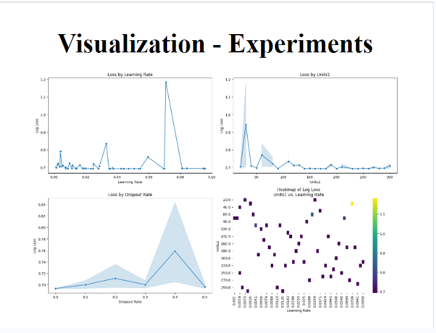
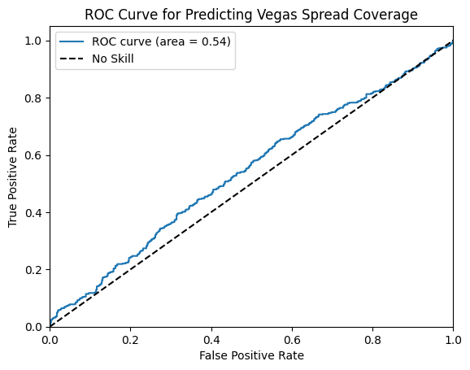

<h1 align="center">Predicting NBA Game Point Spread</h1>

Deric Liang, Dylan Brazier, Zakaria Ali

## Purpose

The project focuses on building a machine learning pipeline to predict the point spread and develop a betting strategy for NBA games. The data for this project was sourced from Kaggle, comprising various statistics from the 2012-13 to 2018-19 seasons. The dataset includes regular season game scores, betting odds, and other game-related metrics. The data processing involves compiling team performance metrics and normalizing them by season to create a feature set for predictions. The project's objective is to develop and evaluate models that can accurately predict the home team point spread, benchmarking these predictions against actual game spreads and betting odds data.

## Built With

## Setup Instructions

1. **Clone the Repository:** Copy this repository to your local machine.
2. **Download the Dataset:** Download the dataset from Kaggle [here](https://www.kaggle.com/datasets/erichqiu/nba-odds-and-scores?resource=download).
3. **Save the Dataset:** Save the `NBA Data` files into a folder named `NBA data - raw`.
4. **Load the Dataset:** The notebook is configured to load the dataset from the `NBA data - raw` folder. Ensure that the file path is correct.
5. **Additional Configuration:** Additional configuration might be needed based on your environment and setup.

## Recommendations

We strongly suggest using Google Colab to execute the notebook. 

## Data

The data was sourced from Kaggle [here](https://www.kaggle.com/datasets/erichqiu/nba-odds-and-scores?resource=download). The dataset is organized with three files per season from the 2012-13 season to the 2018-19 season. The data includes:

1. **raw_scores.txt:** Contains game-level information such as points per quarter, points per overtime, total points, rebounds, assists, turnovers, FG%, FT%, and FG3%. Each game and team is uniquely identified, and the file includes regular season games only.
2. **vegas.txt:** Provides betting odds from five sportsbooks on moneyline, spread, and over/under bets for regular season games. Each game and team is uniquely identified, matching the IDs in the raw scores data.
3. **vegas_playoff.txt:** Contains similar information as vegas.txt but for playoff games. This data is excluded from our analysis as the raw scores data does not include playoff games.

The data directory should include a sub-directory named `NBA data - raw` with sub-directories for each season from `2012-13` to `2018-19`.

## Pre-processing and Exploratory Data Analysis (EDA)

Data pre-processing and EDA are performed in the '01_Data_Processing.ipynb' notebook. This process involves:

- Compiling a game-level database of home and away team performances over the previous 5, 10, and 20 games using the raw scores and Vegas data.
- Calculating team performance features such as win rate, average total points, rebounds, assists, turnovers, FG%, FT%, and FG3%, normalized by season.
- Using these features to predict the home team point spread for each game, benchmarking predictions against actual game spreads and the average home game spread from the Vegas data.

The processed data is saved in a sub-directory named 'NBA data - processed,' containing the compiled training, validation, and test features and labels.

## Modeling

Details on the experiments performed and the deployment of the final model are specified in the project documentation. The modeling process involves training machine learning models on the pre-processed data and evaluating their performance in predicting the point spread.

### ML Modeling - Neural Network
This section details the model architecture, hyperparameter tuning process, and training methodology.

#### Model Architecture
- **Input Layer**: Features reflecting team performance and game-related statistics.
- **Hidden Layers**:
  - Layer 1: 10-300 neurons, 'relu' or 'tanh' activations.
  - Dropout 1: Rate between 0 and 0.5.
  - Layer 2: Similar to Layer 1.
  - Dropout 2: Rate between 0 and 0.5.
- **Output Layer**: Single neuron to predict the probability that the Vegas spread is covered.

#### Hyperparameter Tuning
- **Tool Used**: Hyperopt Library.
- **Tuned Parameters**: Neuron counts, activation functions, dropout rates, learning rate.
- **Goal**: Achieve the lowest possible validation loss to maximize accuracy.

#### Training Process
- Consistency from setting seed, trained 15 epochs with batches of 32 samples.
- Validation phase to prevent overfitting and monitor generalization.

### Justification for Non-Linear ML Approach
The justification for using a non-linear approach is based on the complex relationships, feature interactions, model performance, and real-world applicability.

#### Key Points
- **Complex Relationships**: NBA game outcomes involve a complex interplay of features. Linear models may not capture these intricate relationships effectively.
- **Feature Interactions**: Non-linear models capture interactions between features. Combined effects of team statistics can be non-linear.
- **Model Performance**: Non-linear models (e.g., Random Forests, Neural Networks) outperform linear models by better capturing non-linear dependencies.
- **Real-World Applicability**: Real-world relationships between variables are rarely linear. Non-linear approaches lead to better generalization and reliable predictions.
- 
## Results

The results section will provide a comprehensive analysis of the model's performance, including metrics and visualizations to demonstrate the effectiveness of the predictions compared to actual game spreads and betting odds.

### Kelly Criterion
The Kelly Criterion results highlight the returns from the betting strategy based on the model's predictions.

| Dataset | Total return | Number of games | Percent return | Average return per game |
|---------|--------------|-----------------|----------------|-------------------------|
| Baseline - validation | $0 | 1,230 | 0% | $0 |
| Training | $5,691.82 | 6,104 | 43.9% | $0.93 |
| Validation | $2,611.47 | 1,230 | 56.8% | $2.12 |
| Test | $2,041.75 | 1,226 | 43.6% | $1.67 |

#### Kelly Criterion Strategy
- **Idea**: Generates betting strategy (i.e., bet sizing) in gambling context, given a bankroll. Formula based on the probability of a win and odds to return a percentage of the bankroll to wager.
- **Formula**: \( f* = p - (1-p) / b \)
  - \( f* \): Percentage of bankroll to wager.
  - \( p \): Probability of winning the bet.
  - \( b \): Proportion of the bet gained with a win.
- **Result**: Allows us to account for confidence in the bet, rather than binary win/lose classification. Generates a strategy to win money over time. The analysis assumes a $100 bankroll available for each game.

### Experiment Results and Final Model Evaluation
The following visualizations illustrate the performance of the model during various experiments. These include the impact of learning rate, number of units, and dropout rate on model loss. Additionally, the final model evaluation includes the log loss and accuracy over epochs for both training and validation sets, helping to understand the convergence and generalization of the model.

    
    
    

#### Experiment Results
- **Learning Rate**: 0.01 minimizes model loss.
- **Number of Units**: 230 neurons in layer 1, 30 neurons in layer 2.
- **Dropout Rate**: Rate of 0.5 prevents overfitting.
- **Heatmap of Log Loss**: Visualizing the interaction between units and learning rate.

#### Final Model Evaluation
- **Log Loss over Epochs**: Tracks the reduction in log loss during training and validation. Demonstrates rapid learning and no overfitting concerns.
- **Accuracy over Epochs**: Measures the model's accuracy improvement over time; results in slight improvement (~3%) over the baseline.

## Conclusion

- Developed a model to predict NBA game point spreads, likelihood of covering the Vegas spread, and put forth a betting strategy using Kelly Criterion.
- Benchmarked predictions against actual game spreads and betting odds.
- Future work: refining models, exploring additional features, real-time predictions.

## Contributions
Throughout the project, the team maintained close communication and regularly collaborated on key decisions. Brainstorming sessions were held to refine the project’s direction, and each member provided feedback on each other's work. This collaborative approach ensured that the project was thorough, cohesive, and that all angles were considered in the development of the final models and strategy.

| Task | Contributors |
|---------|--------------|
| Data selection | Zakaria Ali |
| Data processing | Deric Liang |
| EDA | Dylan Brazier |
| Modeling | Deric Liang, Dylan Brazier |
| Kelly Criterion Implementation | Deric Liang |
| Slides | Zakaria Ali, Dylan Brazier, Deric Liang |
| Report | Zakaria Ali |

### Adding Feedback!
