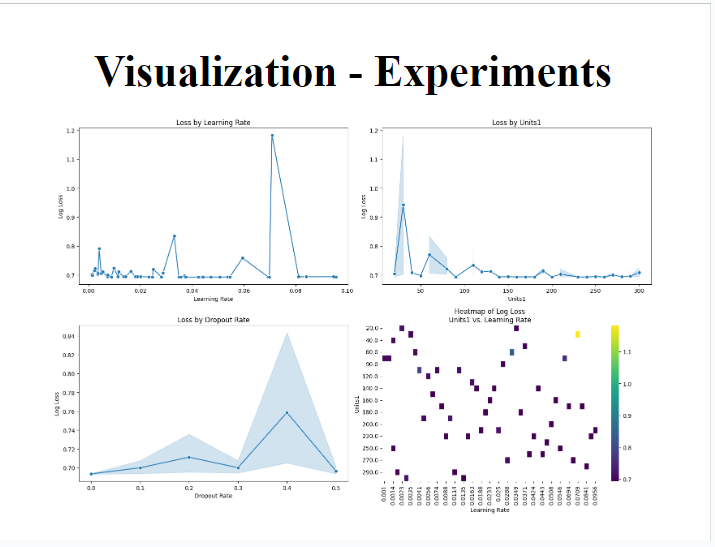
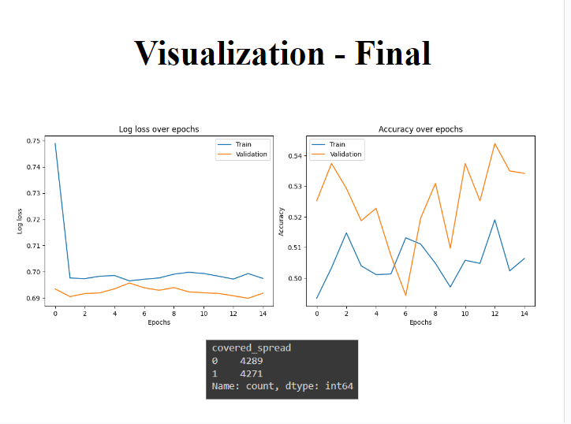

<h1 align="center">Predicting NBA Game Point Spread</h1>

Deric Liang, Dylan Brazier, Zakaria Ali

## Purpose

The project focuses on building a machine learning pipeline to predict the point spread and develop a betting strategy for NBA games. The data for this project was sourced from Kaggle, comprising various statistics from the 2012-13 to 2018-19 seasons. The dataset includes regular season game scores, betting odds, and other game-related metrics. The data processing involves compiling team performance metrics and normalizing them by season to create a feature set for predictions. The project's objective is to develop and evaluate models that can accurately predict the home team point spread, benchmarking these predictions against actual game spreads and betting odds data.

## Built With

## Setup Instructions

1. **Clone the Repository:** Copy this repository to your local machine.
2. **Download the Dataset:** Download the dataset from Kaggle [here](https://www.kaggle.com/datasets/erichqiu/nba-odds-and-scores?resource=download).
3. **Save the Dataset:** Save the `NBA Data` files into a folder named `NBA data - raw`.
4. **Load the Dataset:** The notebook is configured to load the dataset from the `NBA data - raw` folder. Ensure that the file path is correct.
5. **Additional Configuration:** Additional configuration might be needed based on your environment and setup.

## Recommendations

We strongly suggest using Google Colab to execute the notebook. 

## Data

The data was sourced from Kaggle [here](https://www.kaggle.com/datasets/erichqiu/nba-odds-and-scores?resource=download). The dataset is organized with three files per season from the 2012-13 season to the 2018-19 season. The data includes:

1. **raw_scores.txt:** Contains game-level information such as points per quarter, points per overtime, total points, rebounds, assists, turnovers, FG%, FT%, and FG3%. Each game and team is uniquely identified, and the file includes regular season games only.
2. **vegas.txt:** Provides betting odds from five sportsbooks on moneyline, spread, and over/under bets for regular season games. Each game and team is uniquely identified, matching the IDs in the raw scores data.
3. **vegas_playoff.txt:** Contains similar information as vegas.txt but for playoff games. This data is excluded from our analysis as the raw scores data does not include playoff games.

The data directory should include a sub-directory named 'NBA data - raw' with sub-directories for each season from '2012-13' to '2018-19'.

## Pre-processing and Exploratory Data Analysis (EDA)

Data pre-processing and EDA are performed in the '01_Data_Processing.ipynb' notebook. This process involves:

- Compiling a game-level database of home and away team performances over the previous 5, 10, and 20 games using the raw scores and Vegas data.
- Calculating team performance features such as win rate, average total points, rebounds, assists, turnovers, FG%, FT%, and FG3%, normalized by season.
- Using these features to predict the home team point spread for each game, benchmarking predictions against actual game spreads and the average home game spread from the Vegas data.

The processed data is saved in a sub-directory named 'NBA data - processed,' containing the compiled training, validation, and test features and labels.

## Modeling

Details on the experiments performed and the deployment of the final model are specified in the project documentation. The modeling process involves training machine learning models on the pre-processed data and evaluating their performance in predicting the point spread.

## Results

The results section will provide a comprehensive analysis of the model's performance, including metrics and visualizations to demonstrate the effectiveness of the predictions compared to actual game spreads and betting odds.

### Kelly Criterion
| Dataset | Total return | Number of games | Percent return | Average return per game |
|---------|--------------|-----------------|----------------|-------------------------|
| Baseline - validation | $0 | 1,230 | 0% | $0 |
| Training | $5,691.82 | 6,104 | 43.9% | $0.93 |
| Validation | $2,611.47 | 1,230 | 56.8% | $2.12 |
| Test | $2,143.70 | 1,230 | 46.6% | $1.74 |

### Experiment Results

### Final Model Evaluation

## Conclusion 

## Contributions

